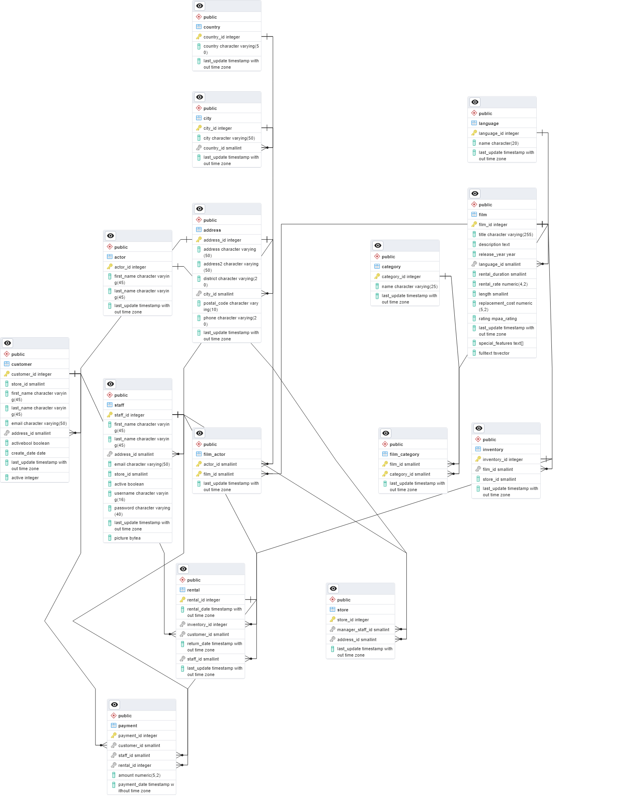

# bonfire119_sql_day_2
SQL Day 2 for Bonfire 119 including ERD, HW, and Notes from today

## This is how we have the structure and relationships of our database set up:

### Tables:
actor: available columns:
first_name: VARCHAR(50)

